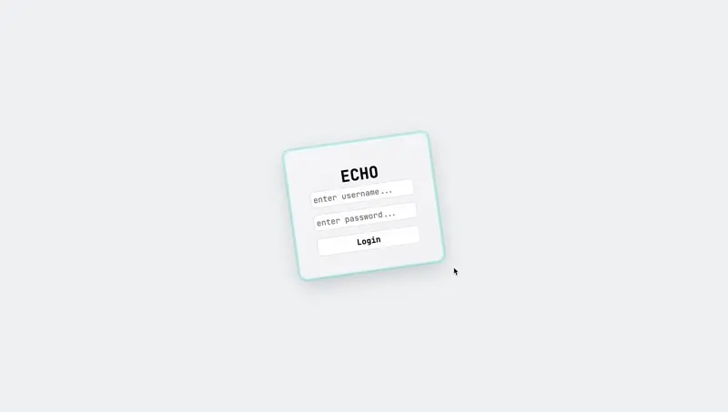

# Echo Messenger

Echo is a full-stack realtime messenger built as a modern monorepo application.
The project focuses on responsive messenger UI, realtime communication, authentication, and clean full-stack architecture.



## Features

* Authentication flow with protected app routes
* Global logout handling on `401 Unauthorized`
* Responsive desktop and mobile messenger layout
* Real chat list with sidebar search
* User search and direct chat creation
* Route-based chat selection
* Paginated message history with “load older messages”
* Realtime message and chat updates
* Message sending with local state synchronization
* Mark chats as read
* Typing indicators
* Online presence and last seen status
* Profile settings dialog
* Prisma + PostgreSQL data layer
* Socket.IO realtime layer
* Shared TypeScript contracts across packages

## Tech Stack

### Frontend

* Vue 3
* TypeScript
* Vite
* Tailwind CSS
* shadcn-vue / Reka UI primitives
* Pinia
* Socket.IO client

### Backend

* Node.js
* TypeScript
* Prisma
* PostgreSQL
* Socket.IO
* Docker Compose for local development

### Monorepo

* pnpm workspaces
* Shared package for common types and contracts

## Project Structure

```txt
packages/
  client/   # Vue frontend application
  server/   # Node.js backend, Prisma, Socket.IO
  shared/   # Shared TypeScript types/contracts
scripts/
  dev.js    # Local development process runner
```

## Getting Started

### Prerequisites

* Node.js
* pnpm
* Docker and Docker Compose

### Installation

```bash
pnpm install
```

### Environment Variables

Create the required `.env` files based on the project configuration.

The server requires database and auth-related environment variables.
The client requires the API URL used to connect to the backend.

### Development

Start the local development environment:

```bash
pnpm dev
```

This starts:

* local PostgreSQL through Docker Compose
* backend server
* frontend Vite dev server

Prisma Studio is optional and can be started separately:

```bash
pnpm db:studio
```

Or together with the dev stack:

```bash
pnpm dev:studio
```

## Scripts

```bash
pnpm dev          # Start Docker/Postgres, server, and client
pnpm dev:studio   # Start dev stack with Prisma Studio
pnpm db:studio    # Start Prisma Studio only
pnpm build        # Build shared, server, and client packages
pnpm lint         # Run ESLint
pnpm lint:fix     # Run ESLint with autofix
pnpm clean        # Clean package build outputs
```

## What This Project Demonstrates

Echo is used as a portfolio/showcase project for:

* Full-stack TypeScript application architecture
* Monorepo structure with shared contracts
* Responsive messenger UI implementation
* Realtime state synchronization with Socket.IO
* Authentication and unauthorized-session handling
* Database modeling and migrations with Prisma
* UI composition with Vue, Tailwind CSS, and shadcn-style primitives
* Practical client-side state management with Pinia

## Status

Echo is in active development.
The current focus is improving the realtime messenger experience, responsive behavior, and profile/settings features.
